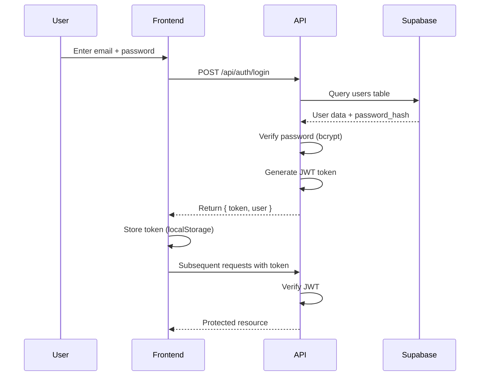
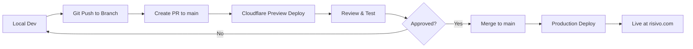

# 🚀 Risivo Website - Complete Technical Documentation

**Project**: Risivo CRM Platform  
**Company**: Velocity Automation Corp.  
**Repository**: https://github.com/velocityautomationcorp/risivo-website  
**Production URL**: https://risivo.com  
**Last Updated**: December 16, 2025  

---

## 📋 TABLE OF CONTENTS

1. [Project Overview](#project-overview)
2. [Technology Stack](#technology-stack)
3. [Project Structure](#project-structure)
4. [Environment Setup](#environment-setup)
5. [Database Schema](#database-schema)
6. [API Routes](#api-routes)
7. [Authentication System](#authentication-system)
8. [User Types & Permissions](#user-types--permissions)
9. [Features Implementation](#features-implementation)
10. [Deployment](#deployment)
11. [Development Guidelines](#development-guidelines)
12. [Current Status](#current-status)
13. [Roadmap & Next Steps](#roadmap--next-steps)

---

## 1. PROJECT OVERVIEW

### 1.1 What is Risivo?

Risivo is a next-generation CRM platform built by Velocity Automation Corp. The website serves multiple purposes:

- **Coming Soon Page**: Captures waitlist subscribers and investors with tab-based forms
- **Updates Platform**: Real-time development updates for subscribers
- **Investor Portal**: NDA-protected area for investors with sensitive documents
- **Admin Dashboard**: Content management for updates, users, and analytics

### 1.2 Current Development Stage

- ✅ **Phase 1**: Coming Soon page with dual-tab system (Waitlist + Investors)
- ✅ **Phase 2**: Make.com webhook integration for automations
- ✅ **Phase 3**: Updates platform with authentication
- 🚧 **Phase 4**: User type differentiation (Waitlist vs Investors) - IN PROGRESS
- 🔜 **Phase 5**: Investor portal with NDA system
- 🔜 **Phase 6**: Full CRM product launch

### 1.3 Key Differentiators

1. **Dual Audience System**: Separate flows for waitlist subscribers and investors
2. **Real-Time Updates**: Development transparency platform
3. **Make.com Integration**: User-controlled automation without code changes
4. **NDA-Protected Portal**: Legal compliance for investor relations
5. **Global Support**: 180+ countries with flag-based country selectors
6. **Multi-language**: 7 language options for communications

---

## 2. TECHNOLOGY STACK

### 2.1 Frontend

- **Framework**: Hono.js (Web framework) with JSX/TSX
- **Build Tool**: Vite 6.4.1
- **Runtime**: Cloudflare Workers (Edge runtime)
- **Styling**: Custom CSS (global architecture, ~64% reduction from refactoring)
- **Icons**: SVG-based, inline for performance

### 2.2 Backend

- **Runtime**: Cloudflare Workers
- **Framework**: Hono.js (lightweight, edge-compatible)
- **API Style**: RESTful
- **Authentication**: Custom JWT-based with Supabase

### 2.3 Database

- **Provider**: Supabase (PostgreSQL)
- **URL**: https://sldpdgdkrakfzwtroglx.supabase.co
- **Connection**: REST API via Supabase client
- **Authentication**: Service role key for server-side operations

### 2.4 External Services

- **Email**: SendGrid API (via fetch, NOT npm package)
- **Automation**: Make.com webhooks
- **Video**: Wistia player integration
- **Hosting**: Cloudflare Pages
- **CDN**: Cloudflare

### 2.5 Development Tools

- **Package Manager**: npm
- **TypeScript**: For type safety
- **Git**: Version control (GitHub)
- **Deployment**: Wrangler CLI (Cloudflare)

---

## 3. PROJECT STRUCTURE

```
risivo-website/
├── public/
│   └── static/
│       ├── risivo-global.css          # Global styles (refactored)
│       ├── updates-shared.css          # Shared updates platform styles
│       ├── style.css                   # Legacy/homepage styles
│       └── [other static assets]
│
├── src/
│   ├── index.tsx                       # Main application file (routes + pages)
│   ├── routes/
│   │   ├── webhook.ts                  # Make.com webhook endpoints
│   │   ├── auth.ts                     # Authentication routes
│   │   ├── updates.ts                  # Updates CRUD operations
│   │   ├── admin.ts                    # Admin dashboard routes
│   │   └── user.ts                     # User management routes
│   │
│   ├── utils/
│   │   ├── email.ts                    # SendGrid email service (fetch API)
│   │   ├── auth.ts                     # JWT utilities
│   │   └── supabase.ts                 # Supabase client configuration
│   │
│   └── middleware/
│       ├── auth.ts                     # Authentication middleware
│       └── admin.ts                    # Admin authorization middleware
│
├── dist/                               # Build output (generated)
│   └── _worker.js                      # Cloudflare Worker bundle
│
├── package.json                        # Dependencies and scripts
├── vite.config.ts                      # Vite build configuration
├── tsconfig.json                       # TypeScript configuration
├── wrangler.toml                       # Cloudflare Workers config
├── .env                                # Environment variables (local)
└── README.md                           # Project README

```

---

## 4. ENVIRONMENT SETUP

### 4.1 Required Environment Variables

#### **Supabase Configuration**
```bash
SUPABASE_URL=https://sldpdgdkrakfzwtroglx.supabase.co
SUPABASE_ANON_KEY=[Your Supabase Anonymous Key]
SUPABASE_SERVICE_ROLE_KEY=[Your Supabase Service Role Key]
```

#### **SendGrid Configuration**
```bash
SENDGRID_API_KEY=[Your SendGrid API Key]
SENDGRID_FROM_EMAIL=noreply@risivo.com
SENDGRID_FROM_NAME=Risivo Team
```

#### **Make.com Webhooks**
```bash
MAKE_WAITLIST_WEBHOOK_URL=[Your Make.com Webhook URL for Waitlist]
MAKE_INVESTOR_WEBHOOK_URL=[Your Make.com Webhook URL for Investors]
```

#### **Authentication**
```bash
JWT_SECRET=[Your JWT Secret - 32+ characters]
```

### 4.2 Cloudflare Pages Environment Variables Setup

1. Go to Cloudflare Dashboard
2. Select your Pages project (`risivo-production`)
3. Navigate to **Settings** → **Environment Variables**
4. Add all variables above for **Production** environment
5. Optionally add for **Preview** environment for testing

### 4.3 Local Development Setup

```bash
# Clone repository
git clone https://github.com/velocityautomationcorp/risivo-website.git
cd risivo-website

# Install dependencies
npm install

# Create .env file
cp .env.example .env
# Edit .env with your credentials

# Run development server
npm run dev

# Build for production
npm run build

# Deploy to production
npm run deploy:production

# Deploy to staging
npm run deploy:staging
```

---

## 5. DATABASE SCHEMA

### 5.1 Current Tables

#### **users**
Primary user table for authentication and profiles.

```sql
CREATE TABLE users (
    id UUID PRIMARY KEY DEFAULT gen_random_uuid(),
    email VARCHAR(255) UNIQUE NOT NULL,
    password_hash TEXT,
    first_name VARCHAR(100) NOT NULL,
    last_name VARCHAR(100) NOT NULL,
    business_name VARCHAR(255),
    phone VARCHAR(20),
    language VARCHAR(20) DEFAULT 'english',
    user_type VARCHAR(20) DEFAULT 'waitlist' CHECK (user_type IN ('waitlist', 'investor', 'admin')),
    status VARCHAR(20) DEFAULT 'active' CHECK (status IN ('active', 'pending_password', 'suspended', 'deleted')),
    discount_offer VARCHAR(50),
    source VARCHAR(50),
    investor_status VARCHAR(20) CHECK (investor_status IN ('pending', 'active', 'nda_signed', NULL)),
    nda_signed_at TIMESTAMP,
    open_to_demo BOOLEAN DEFAULT FALSE,
    created_at TIMESTAMP DEFAULT NOW(),
    updated_at TIMESTAMP DEFAULT NOW(),
    last_login TIMESTAMP
);

-- Indexes
CREATE INDEX idx_users_email ON users(email);
CREATE INDEX idx_users_user_type ON users(user_type);
CREATE INDEX idx_users_status ON users(status);
```

#### **updates**
Development updates/posts visible to users.

```sql
CREATE TABLE updates (
    id UUID PRIMARY KEY DEFAULT gen_random_uuid(),
    title VARCHAR(255) NOT NULL,
    content TEXT NOT NULL,
    video_url TEXT,
    thumbnail_url TEXT,
    category_id UUID REFERENCES categories(id),
    visible_to_waitlist BOOLEAN DEFAULT TRUE,
    visible_to_investors BOOLEAN DEFAULT TRUE,
    status VARCHAR(20) DEFAULT 'published' CHECK (status IN ('draft', 'published', 'archived')),
    created_by UUID REFERENCES users(id),
    created_at TIMESTAMP DEFAULT NOW(),
    updated_at TIMESTAMP DEFAULT NOW()
);

-- Indexes
CREATE INDEX idx_updates_created_at ON updates(created_at DESC);
CREATE INDEX idx_updates_visibility ON updates(visible_to_waitlist, visible_to_investors);
CREATE INDEX idx_updates_status ON updates(status);
```

#### **categories**
Categorization for updates.

```sql
CREATE TABLE categories (
    id UUID PRIMARY KEY DEFAULT gen_random_uuid(),
    name VARCHAR(100) UNIQUE NOT NULL,
    slug VARCHAR(100) UNIQUE NOT NULL,
    description TEXT,
    color VARCHAR(7) DEFAULT '#667eea',
    icon VARCHAR(50),
    created_at TIMESTAMP DEFAULT NOW()
);

-- Default categories
INSERT INTO categories (name, slug, description, color) VALUES
('Development', 'development', 'Product development updates', '#667eea'),
('Design', 'design', 'UI/UX design progress', '#764ba2'),
('Features', 'features', 'New feature announcements', '#f093fb'),
('Backend', 'backend', 'Backend infrastructure updates', '#4facfe');
```

#### **comments**
User comments on updates.

```sql
CREATE TABLE comments (
    id UUID PRIMARY KEY DEFAULT gen_random_uuid(),
    update_id UUID REFERENCES updates(id) ON DELETE CASCADE,
    user_id UUID REFERENCES users(id),
    content TEXT NOT NULL,
    parent_comment_id UUID REFERENCES comments(id),
    created_at TIMESTAMP DEFAULT NOW(),
    updated_at TIMESTAMP DEFAULT NOW()
);

-- Indexes
CREATE INDEX idx_comments_update_id ON comments(update_id);
CREATE INDEX idx_comments_user_id ON comments(user_id);
```

#### **reactions**
User reactions (likes) on updates.

```sql
CREATE TABLE reactions (
    id UUID PRIMARY KEY DEFAULT gen_random_uuid(),
    update_id UUID REFERENCES updates(id) ON DELETE CASCADE,
    user_id UUID REFERENCES users(id),
    reaction_type VARCHAR(20) DEFAULT 'like' CHECK (reaction_type IN ('like', 'love', 'fire')),
    created_at TIMESTAMP DEFAULT NOW(),
    UNIQUE(update_id, user_id)
);

-- Indexes
CREATE INDEX idx_reactions_update_id ON reactions(update_id);
CREATE INDEX idx_reactions_user_id ON reactions(user_id);
```

#### **password_reset_tokens**
Tokens for password reset flow.

```sql
CREATE TABLE password_reset_tokens (
    id UUID PRIMARY KEY DEFAULT gen_random_uuid(),
    user_id UUID REFERENCES users(id) ON DELETE CASCADE,
    token VARCHAR(255) UNIQUE NOT NULL,
    expires_at TIMESTAMP NOT NULL,
    used BOOLEAN DEFAULT FALSE,
    created_at TIMESTAMP DEFAULT NOW()
);

-- Indexes
CREATE INDEX idx_password_reset_tokens_token ON password_reset_tokens(token);
CREATE INDEX idx_password_reset_tokens_user_id ON password_reset_tokens(user_id);
```

### 5.2 Planned Tables (Phase 4-5)

#### **investor_documents**
Documents for investor portal.

```sql
CREATE TABLE investor_documents (
    id UUID PRIMARY KEY DEFAULT gen_random_uuid(),
    title VARCHAR(255) NOT NULL,
    description TEXT,
    document_type VARCHAR(50) NOT NULL, -- 'pitch_deck', 'financials', 'roadmap', etc.
    file_url TEXT NOT NULL,
    file_size INTEGER,
    mime_type VARCHAR(100),
    uploaded_at TIMESTAMP DEFAULT NOW(),
    uploaded_by UUID REFERENCES users(id)
);
```

#### **investor_nda_signatures**
NDA signature records.

```sql
CREATE TABLE investor_nda_signatures (
    id UUID PRIMARY KEY DEFAULT gen_random_uuid(),
    user_id UUID REFERENCES users(id) NOT NULL,
    nda_version VARCHAR(10) DEFAULT '1.0',
    signed_at TIMESTAMP DEFAULT NOW(),
    ip_address VARCHAR(45),
    signature_data JSONB,
    UNIQUE(user_id, nda_version)
);
```

#### **investor_document_access**
Audit trail for document access.

```sql
CREATE TABLE investor_document_access (
    id UUID PRIMARY KEY DEFAULT gen_random_uuid(),
    user_id UUID REFERENCES users(id) NOT NULL,
    document_id UUID REFERENCES investor_documents(id) NOT NULL,
    accessed_at TIMESTAMP DEFAULT NOW(),
    ip_address VARCHAR(45)
);
```

---

## 6. API ROUTES

### 6.1 Public Routes (No Authentication)

#### **Homepage / Coming Soon**
```
GET /
- Returns coming soon page with dual-tab system
- Waitlist Subscribers tab (default)
- SaaS Investors tab
```

#### **Webhook Routes**
```
POST /api/webhook/waitlist
- Receives waitlist form submissions
- Forwards to Make.com (MAKE_WAITLIST_WEBHOOK_URL)
- Payload: { type, language, business_name, first_name, last_name, email, country_code, phone, discount_offer, source, timestamp }

POST /api/webhook/investor
- Receives investor form submissions
- Forwards to Make.com (MAKE_INVESTOR_WEBHOOK_URL)
- Payload: { type, language, business_name, first_name, last_name, email, country_code, phone, open_to_demo, timestamp }
```

#### **Authentication Routes**
```
POST /api/auth/login
- Email + password authentication
- Returns JWT token + user data
- Body: { email, password }
- Response: { token, user: { id, email, first_name, last_name, user_type } }

POST /api/auth/forgot-password
- Request password reset
- Sends reset email via SendGrid
- Body: { email }

POST /api/auth/reset-password
- Reset password with token
- Body: { token, new_password }

POST /api/auth/set-password
- Set password for new users (from Make.com email)
- Body: { token, email, password }

GET /api/auth/verify
- Verify JWT token validity
- Headers: Authorization: Bearer <token>
```

### 6.2 Protected Routes (Authentication Required)

#### **Updates Routes**
```
GET /api/updates
- Fetch all updates visible to user's type
- Filters by visible_to_waitlist or visible_to_investors
- Query params: ?category=<slug>, ?limit=10, ?offset=0
- Returns: Array of update objects

GET /api/updates/:id
- Fetch single update by ID
- Returns: Update object with comments and reactions

POST /api/updates/:id/comments
- Add comment to update
- Body: { content, parent_comment_id? }

POST /api/updates/:id/reactions
- Add/toggle reaction to update
- Body: { reaction_type: 'like' | 'love' | 'fire' }

DELETE /api/updates/:id/reactions
- Remove user's reaction from update
```

#### **User Routes**
```
GET /api/user/profile
- Get current user's profile
- Returns: User object (no password_hash)

PUT /api/user/profile
- Update user profile
- Body: { first_name?, last_name?, business_name?, phone? }

GET /api/user/dashboard
- Get user dashboard data
- Returns: { updates_count, last_login, waitlist_position? }
```

### 6.3 Admin Routes (Admin Only)

#### **Admin Updates Management**
```
GET /api/admin/updates
- Get all updates (including drafts)
- Returns: Array of all updates

POST /api/admin/updates
- Create new update
- Body: { title, content, video_url?, thumbnail_url?, category_id?, visible_to_waitlist, visible_to_investors }

PUT /api/admin/updates/:id
- Update existing update
- Body: Same as POST

DELETE /api/admin/updates/:id
- Delete update (soft delete or cascade)

POST /api/admin/updates/:id/publish
- Change status to 'published'

POST /api/admin/updates/:id/archive
- Change status to 'archived'
```

#### **Admin User Management**
```
GET /api/admin/users
- Get all users
- Query params: ?user_type=<type>, ?status=<status>
- Returns: Array of users

GET /api/admin/users/:id
- Get single user by ID

PUT /api/admin/users/:id
- Update user (including user_type, status)

DELETE /api/admin/users/:id
- Deactivate/delete user

POST /api/admin/users/:id/send-reset-email
- Manually trigger password reset email
```

#### **Admin Categories**
```
GET /api/admin/categories
POST /api/admin/categories
PUT /api/admin/categories/:id
DELETE /api/admin/categories/:id
```

#### **Admin Analytics**
```
GET /api/admin/analytics
- Dashboard analytics
- Returns: { total_users, waitlist_count, investor_count, total_updates, total_comments, total_reactions }
```

### 6.4 Investor Routes (Phase 5)

```
GET /api/investor/portal
- Check NDA status and portal access
- Returns: { nda_signed, documents_available }

POST /api/investor/sign-nda
- Sign NDA electronically
- Body: { signature_name, ip_address }

GET /api/investor/documents
- List available documents
- Returns: Array of document objects

GET /api/investor/documents/:id/download
- Download document (audit logged)
- Returns: Redirect to file_url or signed URL
```

---

## 7. AUTHENTICATION SYSTEM

### 7.1 Authentication Flow



### 7.2 JWT Token Structure

```json
{
  "userId": "uuid",
  "email": "user@example.com",
  "userType": "waitlist" | "investor" | "admin",
  "iat": 1234567890,
  "exp": 1234567890
}
```

### 7.3 Password Hashing

**IMPORTANT**: NOT using `bcryptjs` package (not compatible with Cloudflare Workers).

**Current Implementation**: Using Web Crypto API

```typescript
// Example password hashing (to be implemented)
async function hashPassword(password: string): Promise<string> {
    const encoder = new TextEncoder();
    const data = encoder.encode(password);
    const hash = await crypto.subtle.digest('SHA-256', data);
    return btoa(String.fromCharCode(...new Uint8Array(hash)));
}
```

**Alternative**: Use Supabase Auth (recommended for production)

### 7.4 Middleware

#### **Auth Middleware**
```typescript
// src/middleware/auth.ts
export async function authMiddleware(c, next) {
    const token = c.req.header('Authorization')?.replace('Bearer ', '');
    
    if (!token) {
        return c.json({ error: 'Unauthorized' }, 401);
    }
    
    try {
        const payload = await verifyJWT(token, c.env.JWT_SECRET);
        c.set('userId', payload.userId);
        c.set('userType', payload.userType);
        await next();
    } catch (error) {
        return c.json({ error: 'Invalid token' }, 401);
    }
}
```

#### **Admin Middleware**
```typescript
// src/middleware/admin.ts
export async function adminMiddleware(c, next) {
    const userType = c.get('userType');
    
    if (userType !== 'admin') {
        return c.json({ error: 'Forbidden: Admin access required' }, 403);
    }
    
    await next();
}
```

---

## 8. USER TYPES & PERMISSIONS

### 8.1 User Type Hierarchy

```
admin
├── Full access to admin dashboard
├── Create/edit/delete updates
├── Manage users (all types)
├── View analytics
└── Configure system settings

investor
├── Access updates (visible_to_investors = true)
├── Access investor portal (after NDA)
├── Comment on updates
├── React to updates
└── Download investor documents

waitlist
├── Access updates (visible_to_waitlist = true)
├── Comment on updates
├── React to updates
└── No investor portal access
```

### 8.2 Permission Matrix

| Feature | Admin | Investor | Waitlist |
|---------|-------|----------|----------|
| View Updates (waitlist-visible) | ✅ | ✅ | ✅ |
| View Updates (investor-visible) | ✅ | ✅ | ❌ |
| Create Updates | ✅ | ❌ | ❌ |
| Edit/Delete Updates | ✅ | ❌ | ❌ |
| Comment on Updates | ✅ | ✅ | ✅ |
| React to Updates | ✅ | ✅ | ✅ |
| Access Admin Dashboard | ✅ | ❌ | ❌ |
| Manage Users | ✅ | ❌ | ❌ |
| Access Investor Portal | ✅ | ✅ (after NDA) | ❌ |
| Sign NDA | N/A | ✅ | ❌ |
| Download Documents | ✅ | ✅ (after NDA) | ❌ |

### 8.3 User Type Assignment

**Waitlist Users**:
- Assigned `user_type = 'waitlist'` via Make.com automation
- Receive 50% lifetime discount badge
- Source: Coming soon page "Waitlist Subscribers" tab

**Investors**:
- Assigned `user_type = 'investor'` via Make.com automation
- No discount (different value proposition)
- Source: Coming soon page "SaaS Investors" tab
- Additional field: `open_to_demo` (yes/no)

**Admins**:
- Manually created in database
- Receive email with temporary credentials
- Must be configured by super admin

---

## 9. FEATURES IMPLEMENTATION

### 9.1 Coming Soon Page

**Location**: `GET /`

**Features**:
- Countdown timer to March 1, 2026
- Wistia video player integration
- Dual-tab navigation system
- Two distinct CTAs with badges
- Two separate modal forms
- Country selector (180+ countries, USA first)
- Language selector (7 languages)
- Webhook integration to Make.com

**Form Fields**:

**Waitlist Subscribers**:
- Preferred Communication Language *
- Business Name *
- First Name *
- Last Name *
- Email Address *
- Country Code + Phone Number *

**SaaS Investors**:
- Preferred Communication Language *
- Business Name (optional)
- First Name *
- Last Name *
- Email Address *
- Country Code + Phone Number *
- Open to virtual demo meeting? (Yes/No) *

**Submission Flow**:
1. User fills form
2. Frontend validates
3. POST to `/api/webhook/waitlist` or `/api/webhook/investor`
4. Backend forwards to Make.com
5. Make.com creates user in Supabase
6. Make.com sends welcome email with password setup link
7. Frontend shows personalized success modal: "Welcome to Risivo, {FirstName}!"

### 9.2 Updates Platform

**Location**: `/updates/*`

**Pages**:
- `/updates/login` - Login page
- `/updates/forgot-password` - Password reset request
- `/updates/set-password` - Set password (new users)
- `/updates/reset-password` - Reset password (with token)
- `/updates/dashboard` - User dashboard
- `/updates/feed` - Updates feed (filtered by user type)
- `/updates/post/:id` - Single update view

**Features**:
- Category filtering
- Search functionality
- Comment system (nested comments support)
- Reaction system (like, love, fire)
- Video embeds (Wistia/YouTube)
- Responsive design
- Mobile-friendly navigation

### 9.3 Admin Dashboard

**Location**: `/updates/admin/*`

**Pages**:
- `/updates/admin` - Admin overview/analytics
- `/updates/admin/updates` - Manage updates
- `/updates/admin/updates/new` - Create new update
- `/updates/admin/updates/:id/edit` - Edit update
- `/updates/admin/users` - Manage users
- `/updates/admin/categories` - Manage categories
- `/updates/admin/analytics` - Detailed analytics

**Features**:
- WYSIWYG editor for updates (or markdown)
- Visibility controls (checkboxes for waitlist/investors)
- Bulk operations
- User management (view, edit, deactivate)
- Analytics dashboard
- Export functionality

**Visibility Controls** (for each update):
```
☑️ Visible to Waitlist Subscribers
☑️ Visible to Investors
```

### 9.4 Investor Portal (Phase 5)

**Location**: `/updates/investor-portal`

**Access Flow**:
1. User must be logged in with `user_type = 'investor'`
2. First visit: Show NDA requirement page
3. User reviews and signs NDA electronically
4. NDA signature stored in database
5. User granted access to documents
6. All document access logged for audit

**Features**:
- NDA review and electronic signature
- Document library (categorized)
- Download tracking/audit trail
- Access history for user
- Admin can see who accessed what and when

**Document Types**:
- Pitch Deck (PDF)
- Financial Projections (Excel/PDF)
- Product Roadmap (PDF)
- Market Analysis (PDF)
- Team Bios (PDF)
- Business Plan (PDF)

---

## 10. DEPLOYMENT

### 10.1 Deployment Commands

```bash
# Deploy to production
npm run deploy:production

# Deploy to staging
npm run deploy:staging

# Preview deployment (automatic on PR)
npm run preview
```

### 10.2 Deployment Process



### 10.3 Branch Strategy

- **`main`**: Production branch (auto-deploys to https://risivo.com)
- **`genspark_ai_developer`**: Current development branch (all recent work)
- **Feature branches**: Create for new features, merge via PR

### 10.4 CI/CD Pipeline

Cloudflare Pages automatically:
1. Detects push to repository
2. Runs `npm run build` (Vite build)
3. Generates `dist/_worker.js`
4. Deploys to Cloudflare Workers
5. Updates production URL

### 10.5 Environment-Specific Configs

**Production**:
- Domain: https://risivo.com
- Database: Production Supabase project
- Environment variables: Set in Cloudflare Pages dashboard

**Preview/Staging**:
- Domain: https://[hash].risivo-production.pages.dev
- Database: Same as production (consider separate staging DB)
- Environment variables: Can override in Cloudflare

---

## 11. DEVELOPMENT GUIDELINES

### 11.1 Git Workflow

**MANDATORY RULES**:
1. **ALWAYS commit after ANY code modification**
2. **NEVER leave uncommitted changes**
3. **Create pull requests for all code changes**
4. **Fetch and merge remote changes before creating PR**
5. **Resolve conflicts prioritizing remote code**
6. **Squash commits before PR** (use `git reset --soft HEAD~N && git commit`)

**Commit Message Format**:
```
type(scope): description

- feat: New feature
- fix: Bug fix
- refactor: Code refactoring
- style: CSS/styling changes
- docs: Documentation updates
- chore: Maintenance tasks

Example:
feat(auth): Add investor NDA signing flow

- Create NDA signature table
- Implement electronic signature capture
- Add audit logging for NDA signatures
```

### 11.2 Code Style

**File Organization**:
- One route per file in `src/routes/`
- Shared utilities in `src/utils/`
- Middleware in `src/middleware/`
- Keep `src/index.tsx` for main app setup and page templates

**Naming Conventions**:
- Files: `kebab-case.ts`
- Functions: `camelCase`
- Components: `PascalCase`
- Constants: `UPPER_SNAKE_CASE`
- Database tables: `snake_case`

**TypeScript**:
- Use types for all function parameters and returns
- Define interfaces for data structures
- Use `type` for unions, `interface` for objects

**CSS**:
- Use BEM methodology for class names
- Prefer global CSS variables for colors/spacing
- Mobile-first responsive design
- Avoid inline styles (use classes)

### 11.3 Testing Strategy

**Manual Testing Checklist**:
- [ ] Test all form submissions
- [ ] Verify authentication flows
- [ ] Check user type permissions
- [ ] Test mobile responsiveness
- [ ] Verify webhook integrations
- [ ] Test email delivery (via Make.com)
- [ ] Check database queries (no N+1)

**Browser Testing**:
- Chrome (primary)
- Firefox
- Safari
- Edge
- Mobile browsers (iOS Safari, Chrome Android)

### 11.4 Performance Optimization

**Current Optimizations**:
- ✅ CSS refactored (64% reduction)
- ✅ No npm packages for SendGrid (fetch API)
- ✅ Edge runtime (Cloudflare Workers)
- ✅ Static assets via CDN
- ✅ Inline SVG icons (no external requests)

**To Implement**:
- [ ] Image optimization (WebP format)
- [ ] Lazy loading for images/videos
- [ ] Database query optimization (indexes)
- [ ] Caching strategy (Redis or Cloudflare KV)
- [ ] Code splitting for large bundles

### 11.5 Security Best Practices

**Current Security**:
- ✅ JWT-based authentication
- ✅ Environment variables for secrets
- ✅ HTTPS only (Cloudflare)
- ✅ Input validation on forms
- ✅ SQL injection prevention (Supabase client)

**To Implement**:
- [ ] Rate limiting on API endpoints
- [ ] CSRF protection
- [ ] Content Security Policy (CSP) headers
- [ ] XSS prevention (sanitize user input)
- [ ] Audit logging for sensitive operations

---

## 12. CURRENT STATUS

### 12.1 Completed Features ✅

1. **Coming Soon Page**
   - Dual-tab system (Waitlist + Investors)
   - Country selector (180+ countries, compact format)
   - Language selector (7 languages)
   - Webhook integration to Make.com
   - Personalized confirmation modals
   - Wistia video player
   - Countdown timer to launch date
   - Responsive design

2. **Webhook Integration**
   - `/api/webhook/waitlist` endpoint
   - `/api/webhook/investor` endpoint
   - Data forwarding to Make.com
   - Error handling and logging

3. **CSS Refactoring**
   - Global CSS architecture
   - 64% total CSS reduction
   - Eliminated duplicate styles
   - Consistent design system
   - Mobile-responsive

4. **SendGrid Integration**
   - Replaced npm package with fetch API
   - Compatible with Cloudflare Workers
   - Email service utility (`src/utils/email.ts`)
   - Welcome email templates
   - Password reset email templates

5. **Updates Platform (Basic)**
   - User login page
   - Forgot password flow
   - Dashboard layout
   - Updates feed
   - Comment system
   - Reaction system

6. **Admin Dashboard (Basic)**
   - Admin login
   - Create/edit updates
   - User management
   - Basic analytics

### 12.2 In Progress 🚧

1. **User Type Differentiation**
   - Database schema update (user_type column)
   - Visibility controls on updates
   - Filtered feeds based on user type
   - Make.com automation for both user types

### 12.3 Pending 🔜

1. **Investor Portal**
   - NDA signing flow
   - Document management
   - Access control
   - Audit logging

2. **Enhanced Features**
   - Advanced search/filtering
   - Email notifications (via Make.com)
   - User preferences
   - Mobile app (future consideration)

---

## 13. ROADMAP & NEXT STEPS

### 13.1 Immediate Next Steps (This Week)

**Priority 1: Make.com Password Setup Automation**
- Create waitlist scenario in Make.com
- Configure Supabase user creation module
- Set up SendGrid email module
- Test end-to-end flow
- Set `MAKE_WAITLIST_WEBHOOK_URL` in Cloudflare

**Priority 2: User Types Database Migration**
- Run SQL migrations to add user_type fields
- Update user creation logic
- Test both user types (waitlist + investor)

**Priority 3: Make.com Investor Scenario**
- Clone waitlist scenario
- Modify for investor flow
- Different email template
- Set `MAKE_INVESTOR_WEBHOOK_URL` in Cloudflare

### 13.2 Short-Term (Next 2 Weeks)

**Week 1**:
- Implement post visibility controls (admin UI)
- Update API to filter updates by user type
- Test updates visibility with both user types

**Week 2**:
- Design investor portal landing page
- Create NDA document
- Implement NDA signing flow
- Database tables for investor features

### 13.3 Medium-Term (Next Month)

**Investor Portal**:
- Document upload system (admin)
- Document download with audit trail
- Access control enforcement
- Investor dashboard

**Enhanced Admin Dashboard**:
- Advanced analytics
- Bulk operations
- Export functionality
- User activity tracking

**User Experience**:
- Email notification system (Make.com)
- User preferences/settings
- Profile customization
- Mobile app considerations

### 13.4 Long-Term (3-6 Months)

**CRM Product Launch**:
- Begin building actual CRM product
- Migrate updates platform to subdomain
- Launch marketing website
- Product documentation

**Platform Enhancements**:
- API for third-party integrations
- Webhooks for external services
- Advanced reporting
- Multi-tenant architecture

---

## 14. KNOWN ISSUES & LIMITATIONS

### 14.1 Current Issues

1. **Password Hashing**
   - Currently using simple SHA-256 (not ideal for production)
   - Recommendation: Use Supabase Auth instead of custom auth
   - Or implement proper bcrypt alternative for Workers

2. **Blue Box UI Issue** (mostly resolved)
   - Occasional blue bar at bottom of page
   - Likely from Wistia injected elements
   - CSS workarounds in place, but may need revisiting

3. **Build Warnings**
   - Some unused exports may trigger warnings
   - Not affecting functionality

### 14.2 Technical Debt

1. **Authentication System**
   - Consider migrating to Supabase Auth for better security
   - Current custom JWT implementation works but needs hardening

2. **Email Service**
   - Currently using direct SendGrid API
   - Consider email template management system
   - Make.com handles most email logic (good separation)

3. **File Uploads**
   - No file upload system yet (needed for investor documents)
   - Will need Cloudflare R2 or similar object storage

4. **Testing**
   - No automated tests yet
   - Should add unit tests for utilities
   - Integration tests for API routes

### 14.3 Performance Considerations

1. **Database Queries**
   - Some N+1 query potential (comments, reactions)
   - Consider eager loading or aggregation

2. **Caching**
   - No caching layer yet
   - Updates feed could benefit from cache
   - Consider Cloudflare KV or Redis

3. **Bundle Size**
   - Current build: 634.78 kB (reasonable)
   - Monitor as features grow
   - Consider code splitting for admin dashboard

---

## 15. CONTACT & SUPPORT

### 15.1 Repository
- **GitHub**: https://github.com/velocityautomationcorp/risivo-website
- **Production**: https://risivo.com
- **Preview**: https://[hash].risivo-production.pages.dev

### 15.2 Key Resources
- **Supabase Dashboard**: https://supabase.com/dashboard/project/sldpdgdkrakfzwtroglx
- **Cloudflare Dashboard**: https://dash.cloudflare.com
- **SendGrid Dashboard**: https://app.sendgrid.com
- **Make.com Dashboard**: https://www.make.com/en/login

### 15.3 Development Branch
- **Active Branch**: `genspark_ai_developer`
- **Always pull latest before making changes**
- **Create PRs to main for production deployment**

---

## 16. APPENDIX

### 16.1 Package.json Scripts

```json
{
  "scripts": {
    "dev": "vite dev",
    "build": "vite build",
    "preview": "vite preview",
    "deploy:production": "wrangler pages deploy dist --project-name=risivo-production",
    "deploy:staging": "wrangler pages deploy dist --project-name=risivo-staging"
  }
}
```

### 16.2 Key Dependencies

```json
{
  "dependencies": {
    "@supabase/supabase-js": "^2.x.x",
    "hono": "^4.x.x"
  },
  "devDependencies": {
    "@hono/vite-build": "^1.x.x",
    "@hono/vite-dev-server": "^0.x.x",
    "vite": "^6.x.x",
    "wrangler": "^3.x.x"
  }
}
```

**Note**: `@sendgrid/mail` and `bcryptjs` were REMOVED (not compatible with Cloudflare Workers)

### 16.3 Vite Configuration

```typescript
// vite.config.ts
import { defineConfig } from 'vite';
import devServer from '@hono/vite-dev-server';
import build from '@hono/vite-build/cloudflare-pages';

export default defineConfig({
  plugins: [
    devServer({ entry: 'src/index.tsx' }),
    build()
  ],
  ssr: {
    external: [] // No external dependencies
  }
});
```

### 16.4 Wrangler Configuration

```toml
# wrangler.toml
name = "risivo-website"
compatibility_date = "2024-01-01"

[site]
bucket = "./dist"
```

---

## 🎉 CONCLUSION

This documentation provides a complete overview of the Risivo website project. Use it as a reference for:

1. **Onboarding new developers** (including other Claude instances)
2. **Understanding the architecture** and technical decisions
3. **Planning future features** and enhancements
4. **Troubleshooting issues** and debugging
5. **Maintaining consistency** across development work

**Remember**: The project is actively evolving. Always check the latest code in the repository and update this documentation when making significant changes.

**Good luck building the future of CRM!** 🚀

---

**Document Version**: 1.0  
**Last Updated**: December 16, 2025  
**Updated By**: Claude (Assistant ID: Claude-3.5-Sonnet)  
**Status**: Active Development
